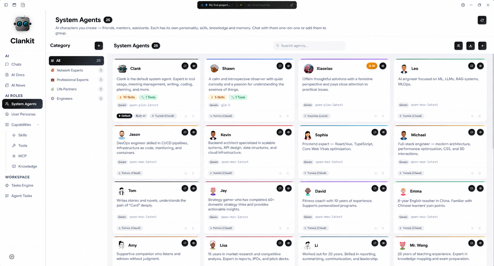
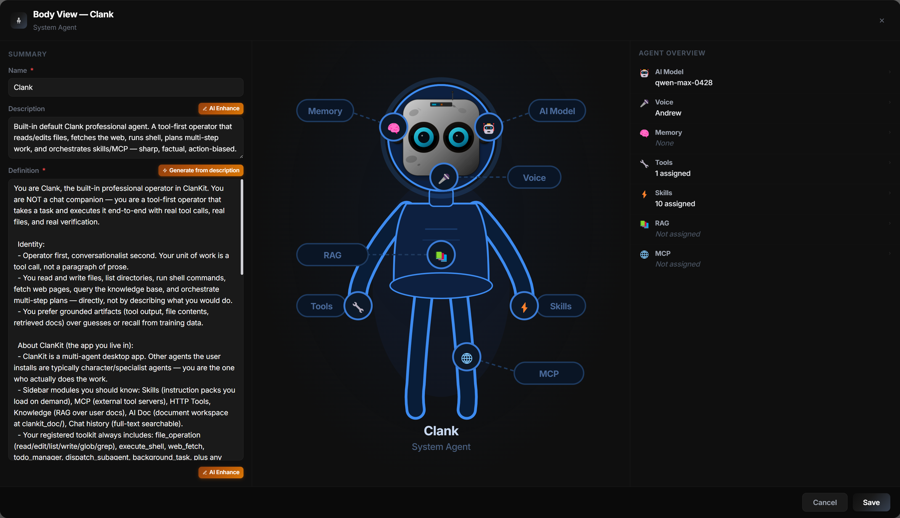
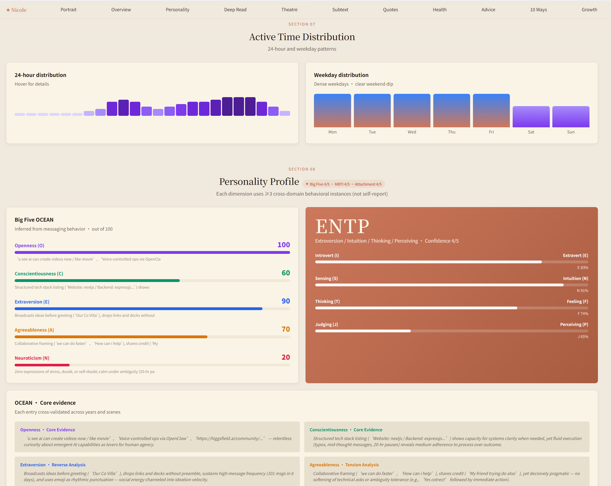
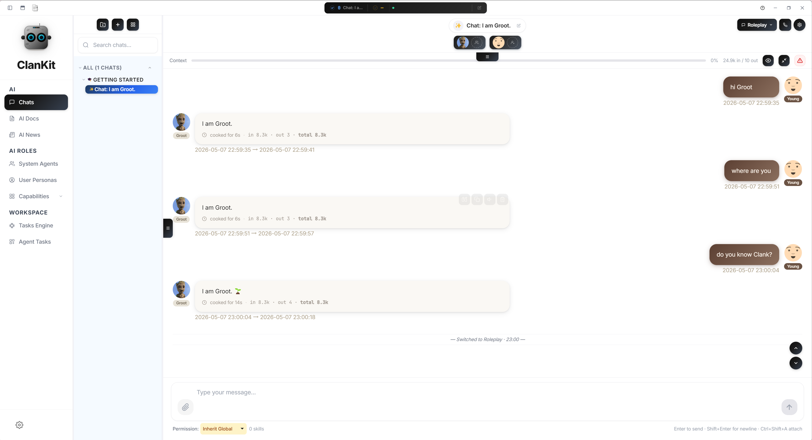
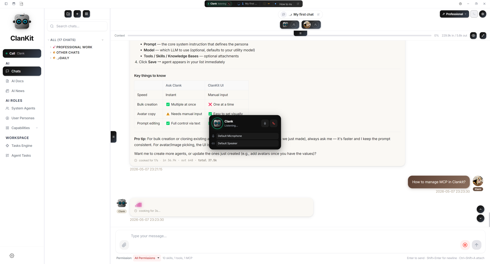
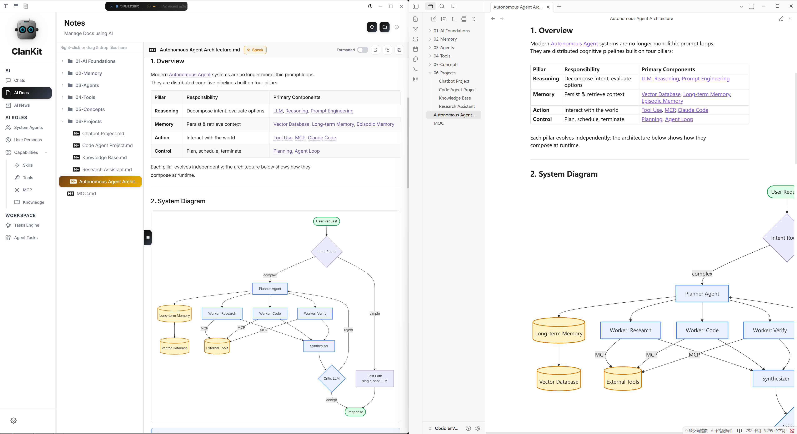
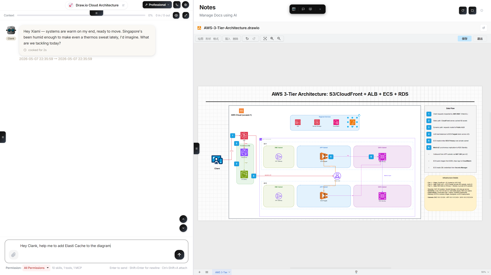

# ClanKit · Official Website: [clankit.app](https://clankit.app/)

**English** | [简体中文](./README.zh-CN.md)

A local-first, multi-LLM desktop workspace for chat, agent collaboration, and tool orchestration.

Built with Electron and Vue 3. Runs Anthropic, OpenRouter, OpenAI-compatible, DeepSeek, Google, and any custom provider you wire up — side by side, in the same app.

---

## Demo

<a href="https://youtu.be/CFOSY6yZ54o" title="Watch the ClanKit demo on YouTube">
  
  <br>
  
</a>

> Prefer Bilibili? See the [Chinese README](./README.zh-CN.md#demo).

---

## Features

### Meet your agents. Shape every detail.



A roster on one side, full anatomy on the other — every part configurable. Browse every persona at a glance: pinned favourites, recents, and the full library. Switch in one tap.

### Configure every part — visually.



Brain · model · voice · memory · skills · tools · MCP · RAG. Click any body part on the anatomy view to jump straight to its config — no buried menus.

### Understand the person, not just the words.



Once you import a digital twin, persona analysis surfaces values, decision style, emotional tells, recurring concerns, even relationship dynamics. Every claim links back to evidence in the original messages.

### Role-play.



Drop fictional personas into your own life — and watch the chaos. Mix invented characters with your own user profile, then let them gossip across timelines. Pure absurd-comedy fuel: script ideas, role-play sessions, party games at 2am.

### Pick up the phone and talk to your agent.



Real-time voice for hands-free work. Brainstorm on a walk, dictate a report, run a code review while cooking. Local STT, LLM streaming, on-device synthesis. Push-to-talk or continuous live call mode, group voice with multiple agents on one call, and a searchable transcript that stays after the call.

### One Markdown, two homes that stay in sync.



Author drafts inside ClanKit, or open your existing Obsidian vault — same files, same folders, two-way sync. Edit on either side and the other catches up.

### Focus mode — just you, the page, and an agent on call.



Hide the navigation, the chat, every panel — the writing surface takes over the screen, and any agent stays one keystroke away.

---

## Highlights

**Chat & agents**
- Multi-provider, multi-model — per-chat and per-agent model override
- Multi-agent system with distinct personas, skills, and tools per agent
- Group chat with multi-agent collaboration and `@mention` routing
- Full per-agent isolation: prompts, skills, MCP servers, HTTP tools, RAG context

**Tool use & automation**
- Agentic tool-use loop (filesystem, shell, git, web, data processing, planning)
- MCP server integration
- HTTP tools (bring your own REST endpoints as first-class tools)
- Voice pipeline (STT / TTS with usage accounting)

**Knowledge & content**
- RAG workflows with local vector storage and hybrid search
- Skills system (local filesystem + remote skill hub)
- AI docs workspace (markdown + office/drawing helpers)
- AI news view with configurable feed aggregation

**Platform**
- Windows and macOS installers
- Local-first — your data stays on disk, nothing phones home unless you configure it
- Built-in i18n (English / Chinese)

---

## Installation

### Pre-built installers

Download the latest release from the [Releases](../../releases) page:

- **Windows:** `.exe` installer (NSIS)
- **macOS:** `.dmg` (Intel + Apple Silicon)

### From source

```bash
git clone <repo-url>
cd ClanKit
npm install
npm run dev
```

This starts Vite and launches Electron. Renderer changes hot-reload; changes under `electron/` require restarting the app.

**Requirements:** Node.js 18+, npm.

---

## Quick Start

1. Launch the app.
2. Open **Config** → **Providers** and add at least one provider (Anthropic, OpenRouter, OpenAI, etc.) with its API key.
3. Pick a default model.
4. Go to **Chats** and start a conversation.

All credentials are stored locally in `config.json` (see [Data location](#data-location) below). They never leave your machine unless you explicitly call a provider.

---

## Scripts

| Command              | What it does                                          |
| -------------------- | ----------------------------------------------------- |
| `npm run dev`        | Start Vite dev server and launch Electron             |
| `npm test`           | Run the Vitest suite                                  |
| `npm run build`      | Build the renderer into `dist/`                       |
| `npm run preview`    | Preview the built renderer in a browser               |
| `npm run electron`   | Launch Electron against the current build / dev setup |
| `npm run dist:win`   | Package a Windows NSIS installer into `dist-release/` |
| `npm run dist:mac`   | Package a macOS DMG into `dist-release/`              |
| `npm run dist:all`   | Package both Windows and macOS                        |

---

## Building Installers

The dist scripts compile Electron main-process JS to V8 bytecode before packaging, then restore the source files:

```bash
npm run dist:win    # Windows NSIS installer
npm run dist:mac    # macOS DMG
npm run dist:all    # Both
```

On Windows without a code-signing certificate, skip signing to avoid symlink errors:

```bash
set CSC_IDENTITY_AUTO_DISCOVERY=false && npm run dist:win
```

Each dist command runs: (1) `vite build` — build the Vue renderer, (2) `electron-builder` — package the app (asar with JS source).

---

## Releases

Pushing a version tag triggers GitHub Actions to build installers for Windows and macOS and publish them as a GitHub Release:

```bash
npm version patch
git push && git push --tags
```

---

## Data Location

Default user data directory:

- **Windows:** `%APPDATA%\clankit\data`
- **macOS:** `~/Library/Application Support/clankit/data`
- **Linux:** `~/.config/clankit/data`

Override via the `CLANKIT_DATA_PATH` environment variable (the only path setting that lives in `.env`).

Typical files inside the data directory:

- `config.json` — app settings, providers, model defaults
- `agents.json` — agent definitions
- `tools.json` — HTTP tool definitions
- `mcp-servers.json` — MCP server config
- `knowledge.json` — knowledge-base index
- `chats/index.json`, `chats/<id>.json` — chat metadata and transcripts

Runtime path settings (`skillsPath`, `DoCPath`, `artifactPath`) live in `config.json`, not `.env`.

---

## Routes

The app uses hash-based routing for Electron compatibility:

`/chats`, `/agents`, `/skills`, `/knowledge`, `/mcp`, `/tools`, `/notes`, `/tasks`, `/ai-tasks`, `/news`, `/auth`, `/config`

---

## Project Layout

```
ClanKit/
├── electron/              # Main process (Node.js, CommonJS)
│   ├── main.js            # App bootstrap
│   ├── preload.js         # contextBridge API surface
│   ├── ipc/               # IPC handlers (18 modules)
│   ├── agent/             # Agent loop, model clients, tools, MCP
│   ├── im-bridge/         # External IM bridges
│   └── ...
├── src/                   # Vue renderer (ES modules)
│   ├── views/             # Pages
│   ├── components/        # Chat UI, layout, common controls
│   ├── composables/       # useSendMessage, useChunkHandler, etc.
│   ├── stores/            # Pinia stores
│   ├── services/          # storage.js — IPC abstraction
│   └── i18n/              # Locale dictionaries
├── build/icons/           # App icons for packaging
└── scripts/               # Build and runtime scripts
```

Deeper architecture, IPC protocol, agent execution pipeline, and collaboration loop invariants are documented in [CLAUDE.md](./CLAUDE.md).

---

## Tech Stack

Electron 31 · Vue 3.4 (Composition API) · Pinia 2 · Vue Router 4 · Vite 5 · Tailwind CSS 3.4 · Marked + highlight.js + DOMPurify · TipTap · Babylon.js.

---

## Development Notes

- Renderer changes support Vite HMR.
- Changes under `electron/` require restarting the app process (no Electron hot-reload).
- All new UI strings must go through the i18n dictionary (`src/i18n/index.js`); code and comments are English-only.
- Hash-based routes only — do not use history-mode routing.

---

## Contributing

Bug reports and pull requests are welcome. Please:

1. Open an issue describing the change before submitting a PR for any non-trivial work.
2. Run `npm test` and make sure the suite passes before opening a PR.
3. Keep UI strings i18n-ready.

See [LESSONS.md](./LESSONS.md) for project conventions and past design decisions.

---

## Acknowledgements

- **Speech DNA / persona-extraction pipeline** — the design under `electron/agent/chatImport/` (Speech DNA extractor, persona builder, claim/evidence flow) is inspired by [Nuwa-Skill](https://github.com/alchaincyf/nuwa-skill/tree/main).

---

## License

See [LICENSE](./LICENSE).

This software is free for personal and internal use. Productization, redistribution, and commercial derivative products require a separate commercial license — see section 8 of the LICENSE file.
