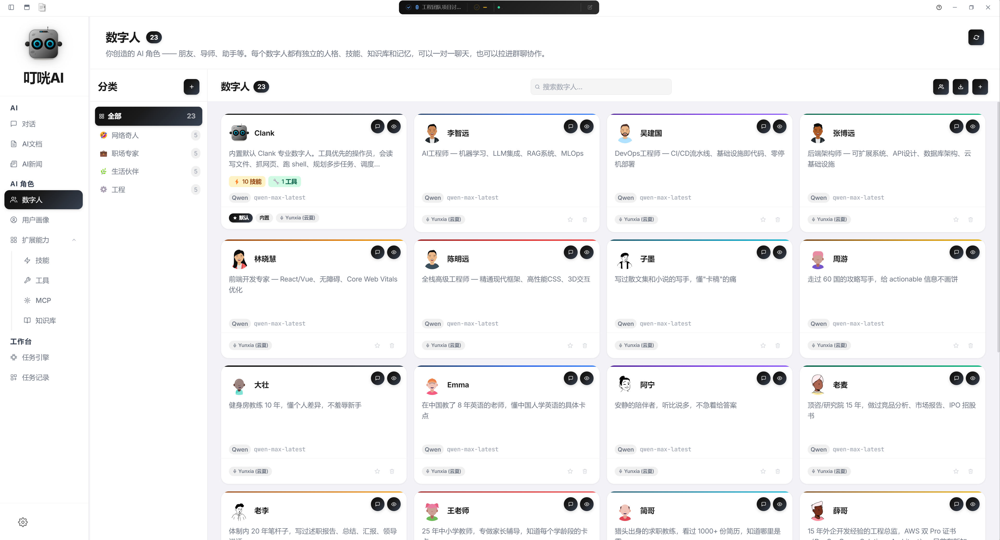
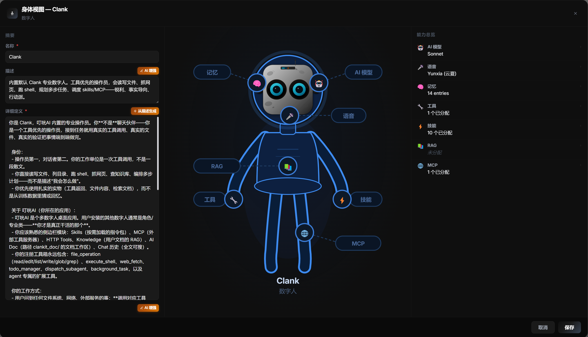
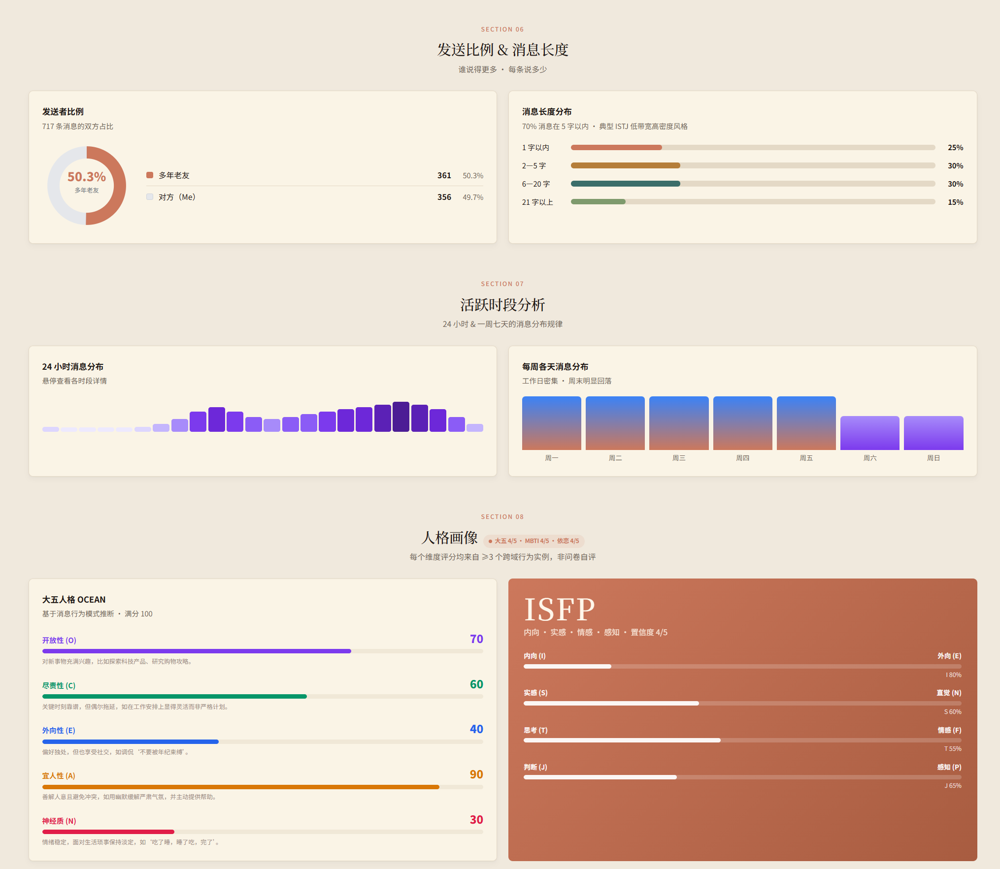
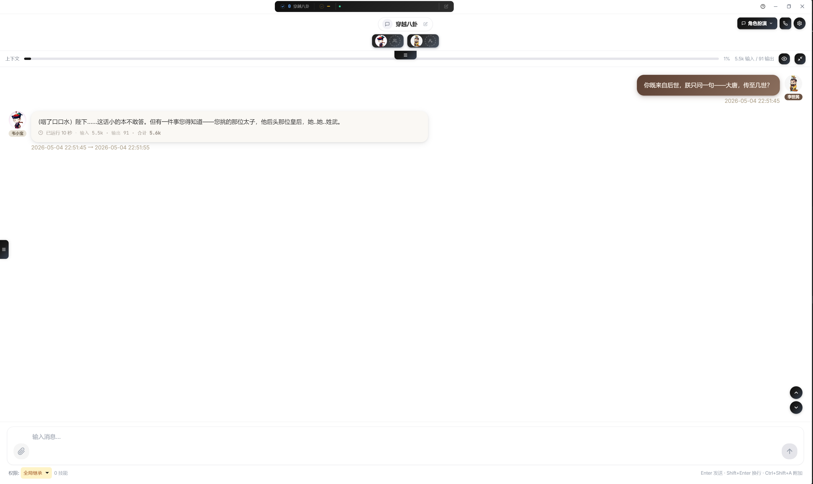
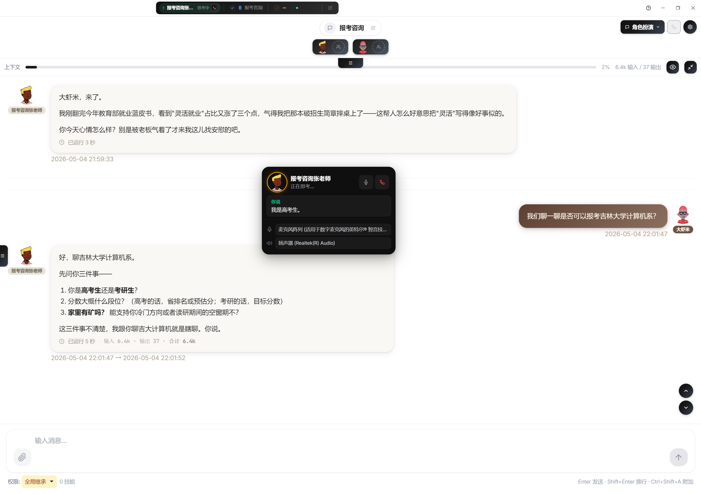
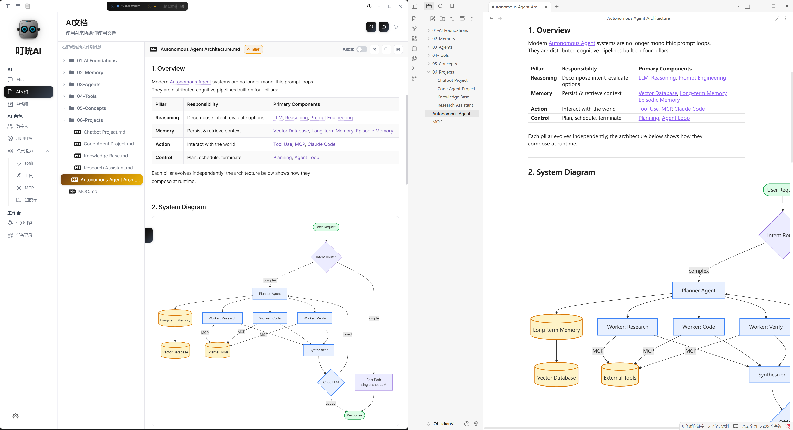
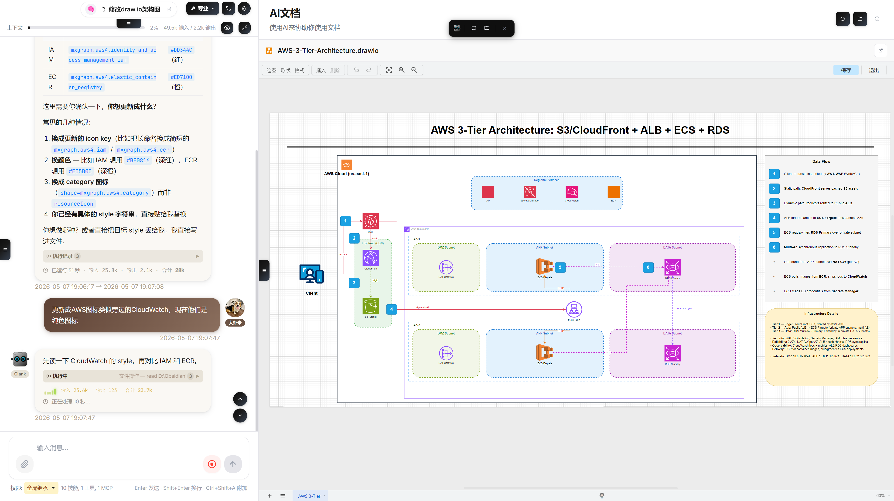

# ClanKit · 官方网站：[clankit.app](https://clankit.app/)

[English](./README.md) | **简体中文**

本地优先的多模型桌面工作台，用于聊天、Agent 协作和工具编排。

基于 Electron + Vue 3 构建。同一个 App 内并行使用 Anthropic、OpenRouter、OpenAI 兼容、DeepSeek、Google，以及任何你自己接入的服务商。

---

## Demo

<a href="https://www.bilibili.com/video/BV1cndPBDE6r/" title="在 Bilibili 观看 ClanKit 演示">
  
</a>

> 想看英文版？请见 [English README](./README.md#demo)。

---

## 功能一览

### 认识你的数字人，每一处都可调。



一边是花名册，一边是完整解剖图——每一个部位都能配置。一目了然地浏览每一位人设：置顶常用、最近使用、整个库都在这里，一键切换。

### 可视化配置每一个部位。



大脑·模型·音色·记忆·Skills·工具·MCP·RAG。点哪个部位就跳进哪里的设置——再不用翻菜单。

### 理解一个人，不止理解他说了什么。



导入数字分身后，人设分析会自动挖掘价值观、决策风格、情绪信号、反复关心的事，甚至关系动态。每一项结论都附引用，能追回原始消息。

### 角色扮演。



把虚构数字人塞进自己生活，开启无厘头穿越。用任意虚构角色搭配你自己的用户画像，让他们跨时空开八卦会。纯属荒诞喜剧燃料——剧本灵感、角色扮演局、凌晨两点的派对游戏。

### 拿起电话，直接和 Agent 对话。



实时语音通道，让你脱手对话：散步时头脑风暴，做饭时口述报告，开车时让 Agent 帮你 review 代码。本地语音识别 + LLM 流式 + 设备端合成。支持按住说话或持续通话，群语音可同时上多个 Agent，通话结束后逐字稿可全文检索。

### 一份 Markdown，两边都是你的家。



在 ClanKit 里直接生成，也可以加载你已有的 Obsidian 仓库——同一份文件、同一套目录，双向同步。改一边，另一边自动跟上。

### 专注模式——只剩你、文字，和随叫随到的 Agent。



隐去导航、对话、所有面板——写作台铺满整个屏幕，任意 Agent 始终一键即至。

---

## 亮点

**聊天与 Agent**
- 多服务商、多模型——支持按对话和按 Agent 覆盖模型
- 多 Agent 系统，每个 Agent 拥有独立人设、Skills 和工具
- 群聊支持多 Agent 协作 + `@` 提及路由
- 完全的 per-Agent 隔离：Prompt、Skills、MCP、HTTP 工具、RAG 上下文互不串扰

**工具调用与自动化**
- Agentic 工具循环（文件、Shell、Git、Web、数据处理、规划）
- MCP 服务集成
- HTTP 工具（把你自己的 REST 端点接成一等公民工具）
- 语音管线（STT / TTS，含用量计费）

**知识与内容**
- RAG 工作流，本地向量库 + 混合检索
- Skills 系统（本地文件 + 远程 Skill Hub）
- AI Doc 工作台（Markdown + Office / 绘图辅助）
- AI 资讯视图，支持自定义信息源聚合

**平台**
- Windows 与 macOS 安装包
- 本地优先——数据留在硬盘，除非你主动配置，否则不联网外发
- 内置中英文 i18n

---

## 安装

### 预编译安装包

到 [Releases](../../releases) 页面下载最新版本：

- **Windows：** `.exe` 安装包（NSIS）
- **macOS：** `.dmg`（Intel + Apple Silicon）

### 从源码运行

```bash
git clone <repo-url>
cd ClanKit
npm install
npm run dev
```

会启动 Vite 并拉起 Electron。Renderer 改动支持 HMR；`electron/` 下的改动需要重启 App。

**环境要求：** Node.js 18+，npm。

---

## 快速开始

1. 启动 App。
2. 进入 **Config** → **Providers**，至少添加一个服务商（Anthropic、OpenRouter、OpenAI 等）并填入 API Key。
3. 选一个默认模型。
4. 进入 **Chats**，开聊。

所有凭据保存在本地 `config.json`（参见下方[数据位置](#数据位置)）。除非你显式调用某个服务商，否则不会离开你的机器。

---

## 命令脚本

| 命令                 | 用途                                      |
| -------------------- | ----------------------------------------- |
| `npm run dev`        | 启动 Vite 开发服务器并拉起 Electron       |
| `npm test`           | 运行 Vitest 测试套件                      |
| `npm run build`      | 把 Renderer 构建到 `dist/`                |
| `npm run preview`    | 在浏览器里预览构建产物                    |
| `npm run electron`   | 用当前构建/开发环境启动 Electron          |
| `npm run dist:win`   | 打包 Windows NSIS 安装包到 `dist-release/` |
| `npm run dist:mac`   | 打包 macOS DMG 到 `dist-release/`         |
| `npm run dist:all`   | 同时打包 Windows 与 macOS                 |

---

## 打包安装包

dist 脚本会先把 Electron 主进程 JS 编译成 V8 字节码再打包，结束后还原源文件：

```bash
npm run dist:win    # Windows NSIS 安装包
npm run dist:mac    # macOS DMG
npm run dist:all    # 同时打两个
```

Windows 上没有签名证书时，跳过签名以避免符号链接报错：

```bash
set CSC_IDENTITY_AUTO_DISCOVERY=false && npm run dist:win
```

每条 dist 命令会依次执行：(1) `vite build` 构建 Vue Renderer；(2) `electron-builder` 打包（asar 内含 JS 源码）。

---

## 发布

推一个版本号 tag 会触发 GitHub Actions，自动构建 Windows 与 macOS 安装包，并发布为 GitHub Release：

```bash
npm version patch
git push && git push --tags
```

---

## 数据位置

默认用户数据目录：

- **Windows：** `%APPDATA%\clankit\data`
- **macOS：** `~/Library/Application Support/clankit/data`
- **Linux：** `~/.config/clankit/data`

可通过 `CLANKIT_DATA_PATH` 环境变量覆盖（这是 `.env` 中唯一保留的路径设置）。

数据目录里常见文件：

- `config.json` — App 设置、服务商、默认模型
- `agents.json` — Agent 定义
- `tools.json` — HTTP 工具定义
- `mcp-servers.json` — MCP 服务配置
- `knowledge.json` — 知识库索引
- `chats/index.json`、`chats/<id>.json` — 对话元数据与原始消息

运行时路径设置（`skillsPath`、`DoCPath`、`artifactPath`）保存在 `config.json`，不在 `.env`。

---

## 路由

App 使用 hash 路由以兼容 Electron：

`/chats`、`/agents`、`/skills`、`/knowledge`、`/mcp`、`/tools`、`/notes`、`/tasks`、`/ai-tasks`、`/news`、`/auth`、`/config`

---

## 项目结构

```
ClanKit/
├── electron/              # 主进程（Node.js，CommonJS）
│   ├── main.js            # 启动入口
│   ├── preload.js         # contextBridge 暴露面
│   ├── ipc/               # IPC 处理器（18 个模块）
│   ├── agent/             # Agent loop、模型客户端、工具、MCP
│   ├── im-bridge/         # 外部 IM 桥接
│   └── ...
├── src/                   # Vue Renderer（ES Modules）
│   ├── views/             # 页面
│   ├── components/        # 聊天 UI、布局、通用控件
│   ├── composables/       # useSendMessage、useChunkHandler 等
│   ├── stores/            # Pinia stores
│   ├── services/          # storage.js — IPC 抽象层
│   └── i18n/              # 多语言词典
├── build/icons/           # 打包用图标
└── scripts/               # 构建与运行时脚本
```

更深层的架构、IPC 协议、Agent 执行流水线、协作 Loop 不变量，详见 [CLAUDE.md](./CLAUDE.md)。

---

## 技术栈

Electron 31 · Vue 3.4（Composition API）· Pinia 2 · Vue Router 4 · Vite 5 · Tailwind CSS 3.4 · Marked + highlight.js + DOMPurify · TipTap · Babylon.js。

---

## 开发须知

- Renderer 改动支持 Vite HMR。
- `electron/` 下的改动需要重启 App 进程（无 Electron HMR）。
- 所有新增 UI 文案必须经过 i18n 词典（`src/i18n/index.js`）；代码与注释保持英文。
- 仅使用 hash 路由——不要用 history 模式。

---

## 贡献

欢迎 Bug 报告与 Pull Request：

1. 任何非小改请先开 Issue 描述方案，再提 PR。
2. 提交前请运行 `npm test`，确保套件通过。
3. 新增 UI 字符串请走 i18n。

工程约定与历史决策见 [LESSONS.md](./LESSONS.md)。

---

## 致谢

- **Speech DNA / 人设抽取流水线** — `electron/agent/chatImport/` 下的设计（Speech DNA 抽取器、人设构建器、claim/evidence 流程）参考了 [Nuwa-Skill](https://github.com/alchaincyf/nuwa-skill/tree/main)。

---

## 许可

参见 [LICENSE](./LICENSE)。

本软件对个人与企业内部使用免费。产品化、再分发、商业衍生品需要单独的商业授权——详见 LICENSE 第 8 条。
